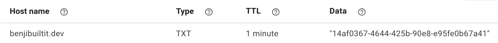

# Domain Ownership Verification API

An API for verifying domain ownership via a TXT record.


## Overview
The domain ownership verification API can be used to verify domain ownership. A live demo along with OpenAPI docs are provided at [verify.benjibuiltit.dev](https://verify.benjibuiltit.dev).

It's usage pattern is simple:
  - Request a verification code
  - Add a TXT record to the domain with the verification code provided
  - Check the verification status

## Detailed Usage
1. Create a verification request by making a `POST` request to `/verification`. Your JSON request body should include a `domain` property where the value is the domain which you would like to verify ownerhsip of.
    ```bash
    curl -d "domain=benjibuiltit.dev" -X POST https://verify.benjibuiltit.dev/verification
    ```

2. Copy the verification `code` that is included in response to your request.
    ```json
    {
      "id": "cb3c35d5-7503-4820-aed8-77c960ab1e5d",
      "domain": "benjibuiltit.dev",
      "code": "14af0367-4644-425b-90e8-e95fe0b67a41",
      "status": 0
    }
    ```
3. Create a TXT record for your domain with the verification code as the TXT record value.
    
4. Make additional `GET` requests as needed to the `verification/:id` endpoint to check the verification status of the domain.
    ```bash
    curl -X GET https://verify.benjibuiltit.dev/verification/cb3c35d5-7503-4820-aed8-77c960ab1e5d
    ```
    ```json
    {
      "id": "cb3c35d5-7503-4820-aed8-77c960ab1e5d",
      "domain": "benjibuiltit.dev",
      "code": "14af0367-4644-425b-90e8-e95fe0b67a41",
      "status": 1
    }
    ```

## Development
The API is developed using NodeJS/TypeScript/NestJS/MongoDB. It is deployed and hosted via [Railway](https://railway.app). New commits on main produce a production deployment to `https://verify.benjibuiltit.dev`. I'm openly admitting that parts of this API are over engineered for a simple demo, but I have done so to illustrate an understanding of and capability to implement certain patterns (dependency inversion, repository pattern, etc) which are valuable in larger enterprise applications.